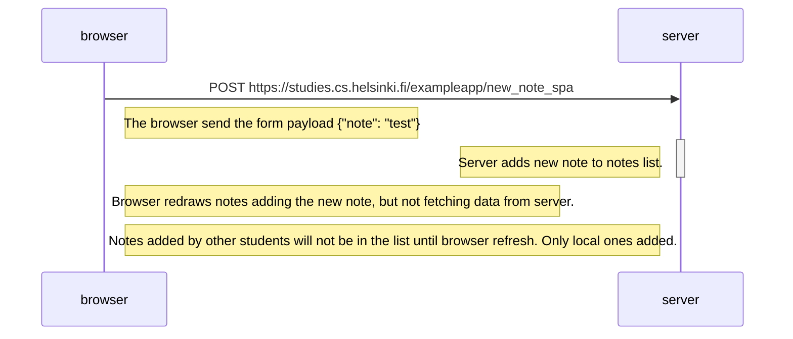

```mermaid
sequenceDiagram
    participant browser
    participant server

    browser->>server: POST https://studies.cs.helsinki.fi/exampleapp/new_note_spa
    Note right of browser: The browser send the form payload {"note": "test"}
    activate server
    Note left of server: Server adds new note to notes list.
    deactivate server
    Note right of browser: Browser redraws notes adding the new note, but not fetching data from server.
    Note right of browser: Notes added by other students will not be in the list until browser refresh. Only local ones added.
```
